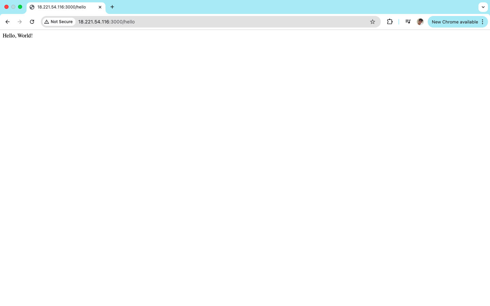
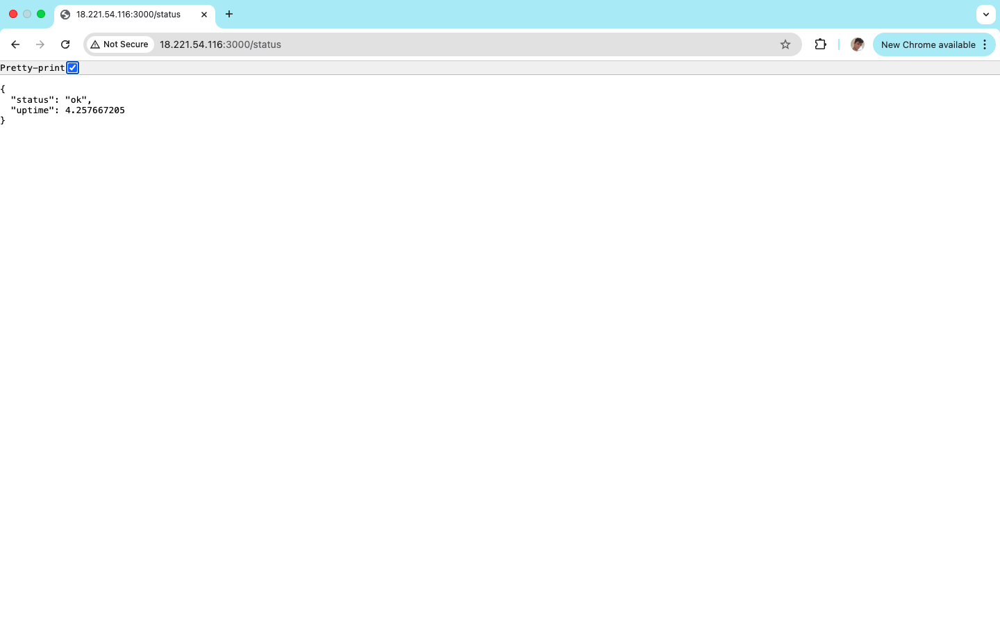
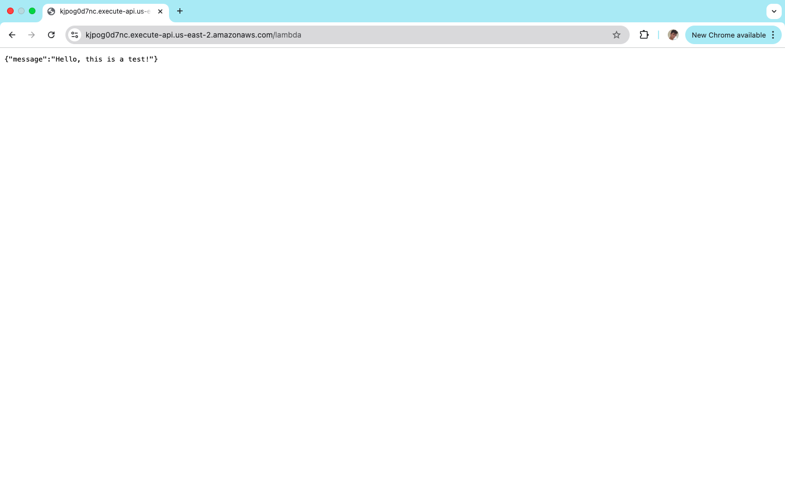

# Assignment: API Deployment Using AWS EC2/Lambda/API Gateway
In this assignment, we deployed a simple Node.js API on an AWS EC2 instance, which responds to HTTP requests and demonstrates basic server functionality. Additionally, a serverless API was created using AWS Lambda and API Gateway, showcasing the ability to handle requests without managing server infrastructure.

## API Deployment Using AWS EC2
For this part of the assignment a simple API contained in `server.js` was added to an EC2 instance running a Node.js server. The server was set up to respond to GET requests on port 3000. A `package.json` file was also added to define the dependencies and scripts needed for the application.

### Setup
To accomplish this, the application went through the following steps:
1. **EC2 Instance Creation**: An EC2 instance was created using the AWS Management Console. The instance was configured with an Amazon Linux 2 AMI and a security group that allows inbound traffic on port 3000.
2. **Instance Access**: SSH access was established to the EC2 instance using a key pair. The instance's public IP address was used to connect via SSH.
3. **Node.js Installation**: Node.js was installed on the EC2 instance using the package manager.
4. **Project Initialization**: A new Node.js project was initialized using `npm init`, which created the `package.json` file.
5. **Server Setup**: A simple HTTP server was created using Node.js, which listens for requests on port 3000 and responds with a message.
6. **Dependencies**: The necessary dependencies were installed using `npm install`, which included the `express` package for handling HTTP requests.
7. **Start Script**: A start script was added to the `package.json` file and run to start the server.

### How It Works
The Node.js server listens for incoming GET requests on port 3000. The API currently handles two endpoints:
- `/hello`: Responds with a "Hello, World!" message.
- `/status`: Responds with a JSON object containing the server status and uptime.

Here are the responses obtained by making GET requests to the API endpoints using the provided public IP address of the EC2 instance:

`GET /hello` :

`GET /status` :

## Serverless API Using AWS Lambda and API Gateway
For the serverless part of the assignment, an AWS Lambda function was created to handle HTTP requests. The Lambda function was set up to respond to requests via API Gateway, allowing it to be invoked without managing any server infrastructure.

### Setup
To set up the serverless API, the following steps were taken:
1. **Lambda Function Creation**: A new Lambda function was created using the AWS Management Console. The function was configured with a `Node.js` runtime and a basic handler that responds to HTTP requests.
2. **API Gateway Configuration**: An API Gateway was created to expose the Lambda function as an HTTP endpoint (`/lambda`). The API Gateway was configured to route requests to the Lambda function.
3. **Deployment**: The API Gateway was deployed, creating a public endpoint that can be accessed via HTTP requests.

### How It Works
The Lambda function is triggered by HTTP requests sent to the API Gateway endpoint. The function processes the request and returns a response.

You can access the Lambda function by using the following invoke URL:

[https://kjpog0d7nc.execute-api.us-east-2.amazonaws.com/lambda](https://kjpog0d7nc.execute-api.us-east-2.amazonaws.com/lambda)

You will get the following response:

